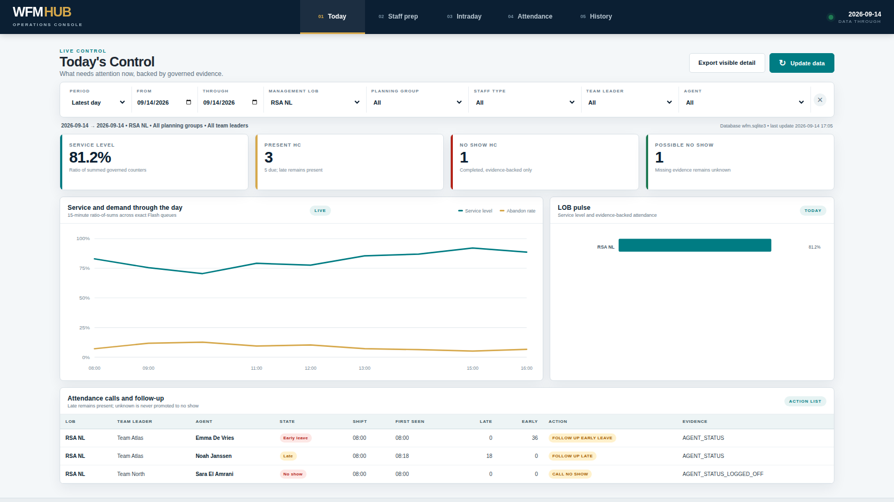

# WFMHub local Operations Console

The Operations Console is the default visual surface from WFMHub `0.34.0`.
Double-click `WEBAPP.cmd`; the bundled Python runtime starts a small server on
`127.0.0.1` and opens your normal browser. Close the command window to stop it.

The picture uses illustrative rows only. The installed console reads the
governed marts from the operator's own SQLite database.

Visual reference: [`WFMHub-Operations-Console.png`](WFMHub-Operations-Console.png).
The screenshot uses synthetic data; the installed console reads the local
governed database.

It is intentionally local and single-user. It cannot be reached from another
computer, does not send data to the internet, and does not run inside
SharePoint. The browser receives governed report rows only; it never opens raw
extracts or the SQLite file itself.

## Daily use

1. Put new extracts in their existing source folders without editing them.
2. Open `WEBAPP.cmd`.
3. Choose **Update data** and wait for Success. This runs the same deterministic
   ingestion and modelling pipeline as WFMHub's Update menu.
4. Select period and organisational filters from left to right.
5. Use **Export visible detail** when an exact CSV handoff is required.

The console reads SQLite directly after an update. There is no second Power BI
refresh, Excel query refresh, ODBC connection, Node.js service or cloud login.

## Five WFM-cycle views

- **Today's Control**: same-day combined service pulse, present/no-show/unknown
  reconciliation and exact call/follow-up list.
- **Staff Preparation**: native 15-minute Verint required FTE versus gross,
  PTO/Away and net published schedule by Planning Group and Staff Type.
- **Intraday Service**: ratio-of-sums service, offered/handled/handled-in-SL and
  exact configured Flash queue diagnosis. RSA BE remains one combined SL.
- **Attendance**: published schedule above Agent Status evidence, exact
  residual start/end gaps and evidence-gated break/meal exceptions.
- **History**: separate service, required/scheduled/observed/productive capacity,
  final Verint absence/shrinkage and recurring schedule-placement evidence.

PCS remains the permanent collaborative Excel tracker. The console does not
copy coaching actions or turn PCS into a single-user dashboard.

## Filters and evidence

Management LOB, Planning Group, Staff Type, Team Leader and Agent selectors
cascade. Service queues and capacity Staff Types remain separate domains.
Missing evidence renders as blank or Unknown; it is never converted to zero or
No Show. Rates are calculated by Python from summed additive components.

The console is read-only except for two explicit operations: the governed Hub
update and downloading a filtered CSV. Attendance corrections still happen in
Verint and disappear from the residual view only after final Activities are
exported and the Hub is refreshed.
