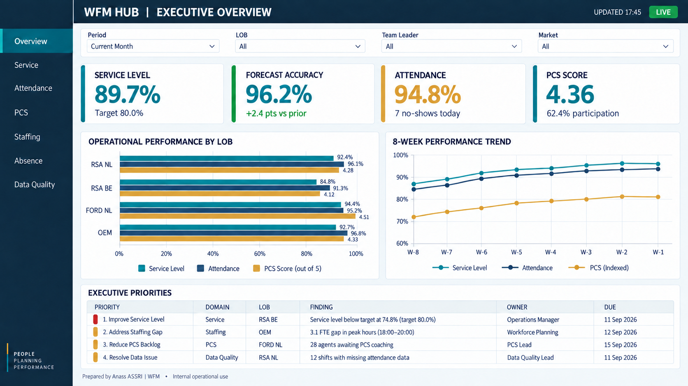
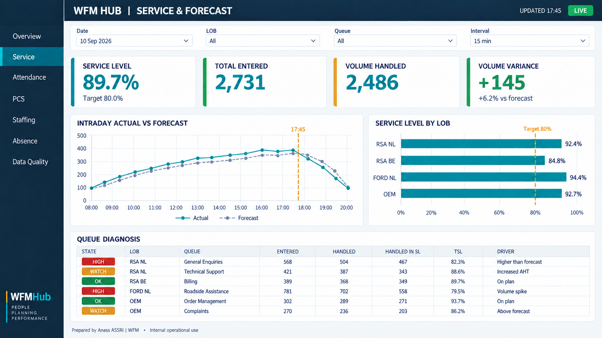
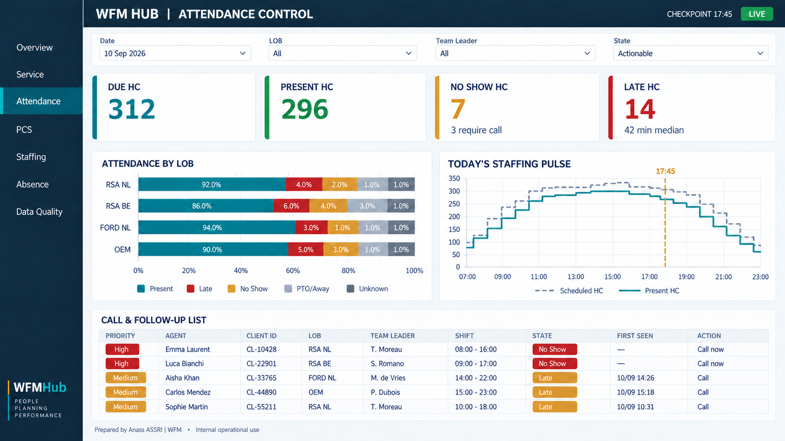
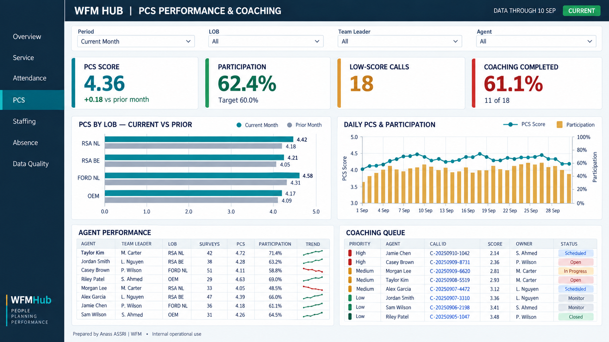
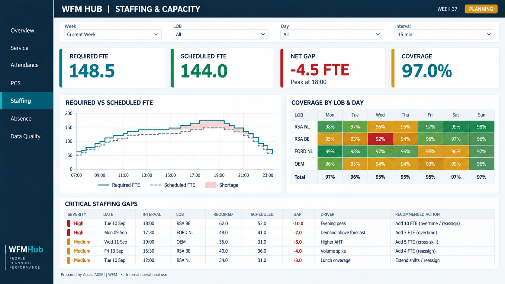
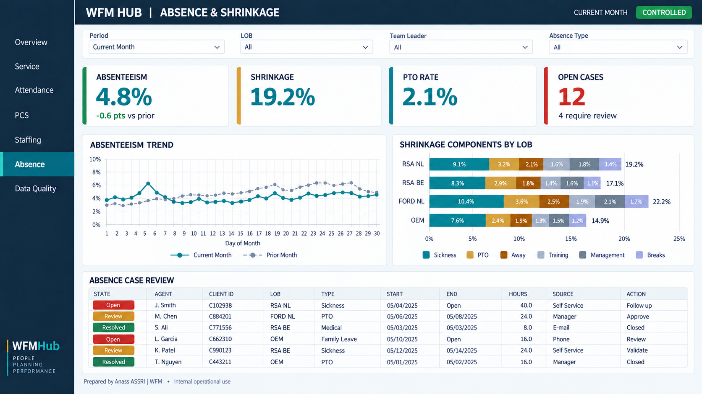
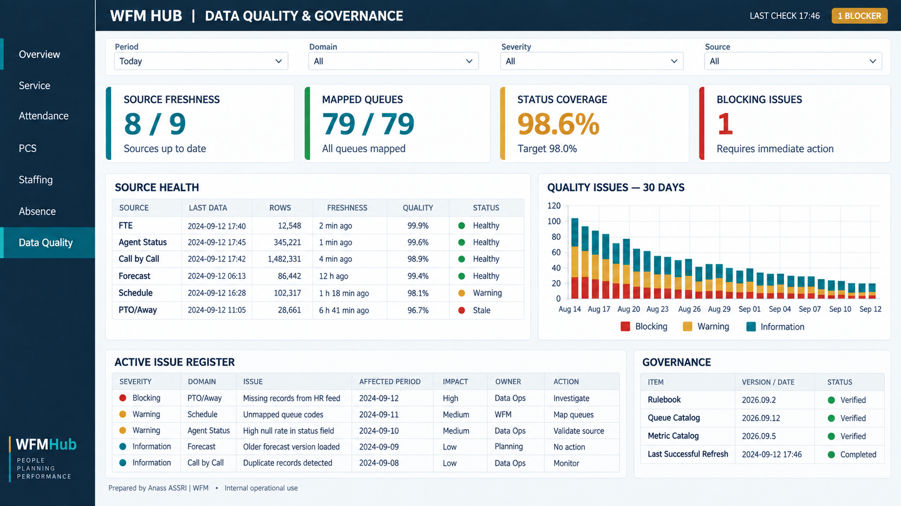

# WFMHub Power BI — premium design proposal V1

Status: **visual proposal only — not implemented**

The existing Excel reports remain part of WFMHub. Power BI is added as a
separate analytical and management layer. All values shown below are
illustrative prototype data.

## Shared experience

All seven pages use one persistent shell:

- WFMHub navy navigation and header;
- active page highlighted in teal;
- four global, page-appropriate slicers;
- exactly four decision KPI cards;
- at most two analytical visuals before the action area;
- compact, filterable decision tables;
- green, amber, and red only for evidence-backed states;
- footer ownership: `Prepared by Anass ASSRI | WFM`.

## 1. Executive Overview

One management screen combining Service, Forecast, Attendance, PCS, and the
highest-priority cross-domain actions.

[Open full-size Executive Overview](design-prototypes/powerbi-premium-v1/01-executive-overview.png)

## 2. Service & Forecast

Intraday 15-minute demand versus forecast, LOB TSL comparison, and the queues
that explain performance.

[Open full-size Service & Forecast](design-prototypes/powerbi-premium-v1/02-service-forecast.png)

## 3. Attendance Control

Same-day attendance pulse, scheduled-versus-present staffing, and exact call or
follow-up population. Unknown evidence stays separate from confirmed no-show.

[Open full-size Attendance Control](design-prototypes/powerbi-premium-v1/03-attendance-control.png)

## 4. PCS Performance & Coaching

Current versus prior PCS, participation, agent results, and call-level coaching
queue with visible Call ID.

[Open full-size PCS Performance & Coaching](design-prototypes/powerbi-premium-v1/04-pcs-performance-coaching.png)

## 5. Staffing & Capacity

Required versus scheduled FTE at 15-minute grain, LOB/day coverage heatmap, and
the critical future gaps requiring an operational decision.

[Open full-size Staffing & Capacity](design-prototypes/powerbi-premium-v1/05-staffing-capacity.png)

## 6. Absence & Shrinkage

Absenteeism trend, transparent shrinkage composition, and the exact cases still
requiring review.

[Open full-size Absence & Shrinkage](design-prototypes/powerbi-premium-v1/06-absence-shrinkage.png)

## 7. Data Quality & Governance

Source freshness, mapping and status coverage, issue history, active blockers,
and the exact configuration versions behind the dashboard.

[Open full-size Data Quality & Governance](design-prototypes/powerbi-premium-v1/07-data-quality-governance.png)

## Validation boundary

Approval of this document approves visual direction and page composition only.
It does not approve illustrative numbers, invent new KPIs, change current Hub
calculations, retire Excel reports, or authorize Power BI publication.
